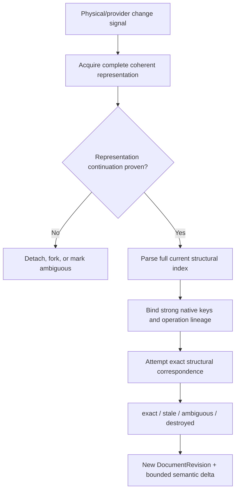

# 01 — Architecture

Status: **FINAL / SYNTHESIZED / VERIFIED / FROZEN FOR BUILD 001**
Operator: **ChatGPT**
Product implementation: **NOT STARTED**

This is the single canonical DOCSeye architecture.

## 1. Definition

**DOCSeye is ChatGPT's persistent, preservation-first, provider-federated document correspondence world: a revisioned operating substrate that maintains conservative logical document and semantic-object identity across native package, live application, layout, render, and fixed-layout representations; indexes current structure; executes exact version-aware typed transactions within declared semantic-effect and serialization-footprint contracts; preserves unsupported provider truth; and returns compact local queries and deltas.**

The ownership rule is:

> Each provider owns the truth native to the representation it defines. DOCSeye owns conservative correspondence, temporal coherence, exact targeting, and agent continuity among those truths.

The correctness rules are:

> Loss of continuity is preferable to mutation of the wrong object.
>
> Unsupported provider truth outside an accepted operation's declared mutation closure survives.

## 2. Why the architecture is differentiated

Open XML SDK plus helpers cannot replace DOCSeye because it does not supply external logical identity, restart recovery, conservative cross-revision correspondence, document/provider/layout clocks, exact-or-stale transactions, semantic deltas, or a local retained-object program surface.

Word automation cannot replace DOCSeye because live Word objects are provider/session realizations, Word may be absent or behind/ahead of disk, Word cannot define PDF/ODF truth, and Word does not provide controller-independent logical identity or DOCSeye's explicit package preservation contract.

A universal AST cannot replace DOCSeye without becoming either lossy or an opaque collection of provider-specific escape bags. DOCX, Word live state, tagged PDF, untagged PDF, ODF, and static HTML have overlapping but nonidentical truths.

The permanent architecture therefore combines capabilities that ordinary SDKs separate:

- provider-native truth;
- full compact current indexing;
- selective persistent correspondence;
- object-specific identity evidence;
- exact structural transactions;
- preservation-aware mutation;
- semantic/layout/render separation;
- bounded deltas and local programs.

## 3. Core invariants

1. Wrong-target mutation is never preferred over continuity loss.
2. A logical ID does not imply a current exact binding.
3. Path, offset, ordinal, table coordinate, text equality, page number, appearance, and embeddings are not durable identity.
4. Provider IDs are evidence only within their documented scope and proven representation lineage.
5. Provider-specific truth is not flattened into fake universality.
6. Unsupported or unknown provider truth is never silently dropped by an unrelated accepted edit.
7. Semantic effect and serialization footprint are independent boundaries and both must pass.
8. Target resolution and mutation occur against the same pinned coherent provider snapshot.
9. Automatic rebase is allowed only when the target and boundaries transform deterministically to one exact candidate.
10. Layout objects never masquerade as semantic identity.
11. Native tracked changes are document content, not DOCSeye revision history.
12. Deltas are bounded; expiration is explicit `resync_required`, never a silent gap.
13. SQLite stores operating correspondence, not canonical document content or permanent history.
14. The Program Host is non-agentic and never owns canonical state.

## 4. Document, representation, and derivation identity

### 4.1 Logical document

`document_*` denotes one logical authored-document branch. It is not a path, NTFS file object, ZIP byte sequence, Word process, cloud item, or native family ID.

### 4.2 Representation

`representation_*` denotes a provider-native representation associated with a document, such as a continuing DOCX representation, a live Word working representation, or a PDF representation.

`RepresentationIncarnation` is one continuous representation/provider lineage. It does not advance on every ordinary save. A provider restart creates a new `ProviderEpoch`, not automatically a new representation incarnation.

### 4.3 Frozen event semantics

| Event | Result |
| --- | --- |
| Rename with exact physical continuity | same `document_*` and representation; location binding changes |
| DOCSeye-controlled save, including atomic physical replacement | same document/representation; new document and representation revisions |
| Word save with exact live-provider lineage | same document; new Word/provider state and persisted revisions as applicable |
| Unexplained file at the same path | never inherits identity from path; old binding detaches/stales |
| Save As | new `document_*`, `DERIVED_FROM source@DocumentRevision`; source remains its own branch |
| Copy/email attachment | new document branch by default; observed copy records derivation |
| DOCX-to-PDF export | new PDF document/representation linked `RENDER_OF` and `EXPORT_OF source@revision` |
| Semantically neutral package reserialization | same document semantic revision; new representation revision |
| Merge of authored documents | new document linked `MERGED_FROM` all exact inputs |

An explicitly requested move/rename that retires the old location is not Save As.

`w15:docId` is a family/derivation witness because Microsoft defines it for documents derived from a common source. It is not DOCSeye branch identity.

### 4.4 External identity by default

DOCSeye logical IDs live in its operating database. Existing content controls, bookmarks, modern comment IDs, paragraph IDs, cloud IDs, and PDF identifiers can be strong native witnesses. DOCSeye does not silently inject hidden IDs into every document object because injection is a real mutation, copies clone IDs, foreign editors can remove them, formats differ, and signatures can cover modified content.

An explicit anchor-enrichment operation may add a native bookmark, content control, or custom structure when that change is intentionally part of the authored document.

## 5. Temporal and coherence model

One counter cannot truthfully describe stored package state, unsaved Word state, layout, and render output.

| Clock/object | Meaning |
| --- | --- |
| `DocumentRevision` | one coherent semantic/native document state accepted by DOCSeye |
| `RepresentationRevision` | one observed serialized or live representation state; a byte-only rewrite can advance this without semantic change |
| `RepresentationIncarnation` | one continuing representation lineage |
| `ProviderEpoch` | lifetime in which live provider objects/handles are valid |
| `ProviderRevision` | provider-native state/version within an epoch |
| `LayoutRevision` | one engine/configuration-specific pagination and semantic-to-layout mapping based on an exact document/provider revision |
| `RenderRevision` | one PDF/bitmap/fixed-format realization based on an exact layout/provider revision |
| `PhysicalFileRevision` | SHELLeye physical-file state correlated to a representation |
| `WorldSequence` | monotonic DOCSeye commit/delta order only |
| `NativeTrackedChange` | a content object inside a document revision, not a clock |

Example:

```text
document_7 @ DocumentRevision D43 [working]
  Word ProviderEpoch E9 / ProviderRevision W71 [current, unsaved]
  DOCX RepresentationRevision P42            [persisted, behind]
  LayoutRevision L19 based_on W71             [current for Word]
```

A representation reports coherence relative to the requested document revision as `current`, `ahead`, `behind`, `conflicted`, `unavailable`, or `incomplete`.

Document objects usually have a logical concept plus revision-local snapshots and provider bindings. They do not mechanically receive an `Incarnation` layer unless a provider-specific lifetime genuinely needs one.

## 6. Provider authority and broker

| Provider/substrate | Authoritative for | Not authoritative for |
| --- | --- | --- |
| OpenXML package provider | stored OPC topology, parts, relationships, XML, binary payloads, package-native semantics | Word pagination, unsaved live state, universal layout |
| Word native provider | current Word working state, Word-native revisions/comments/fields/comparison/save/export behavior | universal package preservation, cold logical identity, other formats |
| Word layout provider | Word pagination and Word semantic-range-to-page/region observations | semantic object identity |
| PDF provider | PDF pages, objects, streams, tags, forms, annotations, signatures, incremental state | invented Word-like semantics in untagged PDF |
| ODF provider | ODF package/content/style/change semantics | OOXML- or Word-specific truth |
| static HTML provider | serialized document/DOM semantics | live browser/network/application state |
| OCR/inference provider | explicitly derived observations with origin/confidence | provider-native semantics |
| SHELLeye | physical file/path/incarnation, locks, filesystem change, atomic replacement | logical document identity |
| DESKTOPeye | Word window/dialog/focus/caret/UI operation | document semantics |
| DOCSeye | logical IDs, correspondence, revisions, exact anchors, transactions, deltas, coherence | provider-native facts |

There is no global fallback ladder. The broker selects the provider whose authority and preservation profile match the operation. If Word has unsaved current state, direct disk mutation is forbidden until the broker reconciles/saves through Word or returns a coherence conflict.

Build 001 isolates Word in a restartable process because native application automation can block or outlive a caller. OpenXML package interpretation remains in-process unless measured evidence requires isolation. The Program Host is disposable.

## 7. OPC and OOXML model

A DOCX is an Open Packaging Conventions package, not merely `document → paragraphs → runs`. The representation contains:

- parts and content types;
- package and part relationships, including external targets;
- XML and binary payloads;
- main and subsidiary stories;
- styles, numbering, settings, themes, headers, footers, notes, comments, revisions, fields, controls, media, equations, embeddings, custom XML, and extensions;
- Markup Compatibility (`mc:*`) rules and `mc:AlternateContent`;
- possible signatures, VBA, OLE/ActiveX, custom parts, and encryption envelopes.

The package provider has four layers:

1. **Raw package topology** — entry/part bytes, types, relationships, signatures, and opaque content.
2. **Namespace/markup preservation** — source XML, unknown attributes/elements, MC context, and exact edit regions.
3. **Typed interpretation** — current Open XML SDK schema objects, streaming, and validation.
4. **DOCX semantic facet** — stories, paragraphs, lists, logical tables, comments, changes, fields, controls, figures, and relations.

Open XML SDK is the typed interpretation/validation layer, not the sole fidelity boundary. Its Markup Compatibility preprocessing can remove MC attributes and unselected alternate branches, so destructive preprocessing is prohibited on the preservation write path unless conversion is the explicit operation.

Build 001 edits ordinary Transitional DOCX and retains conformance information. Strict input is detected and reported; complete Strict mutation is deferred unless an exact supported operation proves safe.

Encrypted content reports `encrypted` unless an authorized provider can expose the contained package. DOCM content can be preserved without executing VBA. Signature coverage and impact are intrinsic provider facts, not a separate approval architecture.

## 8. Semantic object model

The common vocabulary is deliberately small and incomplete:

```text
document_*            authored branch
representation_*      provider-native representation
story_* / flow_*      body, header, footer, note, comment, text-box flow
section_*             section and section-boundary semantics
block_*               useful provider-neutral block correspondence
paragraph_*           paragraph-like semantic block
span_*                retained exact text/inline range
list_* / list_item_*
table_* / row_* / physical_cell_* / cell_region_*
style_*               document-scoped style definition
comment_*             collaborative comment/thread object
change_*              native tracked/suggested change
control_*             content control/form object
bookmark_*            provider-native marker/range
field_*               instruction + result/state
note_*                footnote/endnote
link_*                hyperlink/cross-reference
figure_*              one placed visual occurrence
media_asset_*         underlying reusable bytes
math_*                semantic math object, OMML-native for Word
embedded_object_*
layout_view_* / page_view_* / region_*
pdf_page_*            provider-native fixed-layout page
```

Headings are normally paragraph roles/facets. `annotation_*` can be a cross-format conceptual category but does not erase provider-native comment/annotation differences.

Runs, arbitrary XML nodes, offsets, paragraph ordinals, table coordinates, rendered lines, DOCX page numbers, search hits, OCR words, and inferred PDF blocks are revision-local by default. They may be queried and can be promoted only when a real persistent use and sufficient evidence exist.

Provider facets remain first-class. A `paragraph_*` can expose OpenXML, Word-live, and layout facets without any one facet replacing the others.

## 9. Resolution and assurance states

Mutation resolution is one of:

```text
exact_current
exact_rebased
stale
ambiguous
destroyed
unsupported
```

Observation origin/assurance is separate:

```text
native_stored
native_live
provider_computed
reconstructed_exact
heuristic_structure
ocr_derived
visual_inferred
```

An inferred observation can be useful for search while remaining ineligible for destructive mutation.

## 10. Object-specific identity evidence

| Object | Strongest to weakest useful evidence | Exact write rule |
| --- | --- | --- |
| Document | DOCSeye operation/save lineage; immutable cloud/native item lineage; exact live Word save lineage; family/physical/semantic witnesses | path, title, hash, or `docId` alone never proves sameness |
| Paragraph | operation lineage; `part + paraId` under proven representation lineage plus corroboration; exact semantic container; unique structural correspondence | text, ordinal, style, or page alone never |
| Span | exact known-edit transform; surviving native marker/control/bookmark; exact parent and unique boundary mapping | nearest/fuzzy occurrence never |
| Section | operation lineage; exact boundary paragraph/section-property correspondence | split/merge can retire old section concept |
| List item | exact paragraph identity plus numbering facet | displayed label/ordinal never |
| List | operation lineage; numbering source plus exact member continuity | `numId` alone not universal |
| Table | operation lineage; exact provider subtree under exact parent; unique topology/anchors | location alone insufficient |
| Row | operation lineage; row `paraId` where experimentally proven; exact table plus unique structure | row index/values never |
| Cell | operation lineage; exact row plus logical grid interval/topology and descendants | coordinate/text alone never |
| Comment | operation lineage; modern durable ID in proven document scope; legacy ID plus exact anchor/thread | quoted text never |
| Tracked change | operation lineage; exact provider change element/key/type and owning structure | author/text/time/index never |
| Content control | operation lineage; native control ID in proven document scope; binding/tag/type corroboration | tag alone not unique |
| Bookmark | operation lineage; exact current paired markers/name in provider scope | recreated same name is new |
| Style | operation lineage; provider style ID in document scope; definition graph | visible name alone never |
| Figure | operation lineage; native drawing/anchor/relationship under exact paragraph | media hash identifies asset, not occurrence |
| Media asset | exact part/relationship and payload digest | repeated bytes may be one shared asset |
| PDF page | operation lineage; indirect page object in proven PDF representation | ordinal alone never |
| Tagged PDF item | exact structure-tree object in proven representation; parent/content mapping | role/text/MCID alone never global |
| OCR/inferred block | no inherent destructive authority | bind first to exact provider-native representation |

`w14:paraId` is part-scoped and has an AlternateContent exception. `w14:textId` is paragraph-version evidence. Current Word JavaScript paragraph IDs explicitly differ across sessions and coauthors; they are live-provider keys only. Existing Word content-control IDs and modern comment durable IDs are stronger but still scoped witnesses, not global DOCSeye IDs.

## 11. Paragraphs and spans

A retained span records at least:

```text
document + base DocumentRevision
exact parent paragraph/story
text projection
provider part/native key witnesses
start/end semantic boundaries and affinity
selected-text digest
bounded left/right context digests
structural child/neighbor witnesses
surviving bookmark/control/comment/range anchors
bounded exact operation-transform chain
```

Digests and content are witnesses, not identity.

Old-span write resolution:

1. resolve the document and exact parent;
2. pin the current authoritative representation;
3. transform boundaries through known exact DOCSeye edits;
4. incorporate surviving strong native markers;
5. verify semantic/structural preconditions;
6. require exactly one candidate;
7. otherwise return `stale` or `ambiguous`.

Run split/merge is representation churn, not semantic identity churn. Paragraph split retires the old whole-paragraph mutation handle and returns explicit `SPLIT_FROM` descendants. Merge creates a new paragraph `MERGED_FROM` the inputs; old unrestricted handles do not silently alias it.

Every plain-text query states story scope, tracked-change projection, field instruction/result policy, hidden/deleted inclusion, and base revision.

## 12. Lists

Word list display is derived from paragraph numbering properties, numbering instances, abstract definitions, levels, overrides, restarts, styles, and sequence context.

`list_item_*` normally rides on paragraph identity. Displayed bullets/numbers and ordinals are never identity. A numbering-definition mutation can intentionally change many displayed labels while paragraph concepts remain unchanged. Logical `list_*` grouping is a semantic projection above native numbering truth and never replaces it.

Typed operations include insert/move/relevel/restart, attach/detach numbering, change definition, and conversion to ordinary paragraph. Converting an item can retain the paragraph while retiring the list-item relation.

## 13. Tables

DOCSeye computes both physical WordprocessingML cells and a logical occupancy topology covering declared grid positions, `gridBefore/gridAfter`, horizontal spans, vertical-merge chains, omitted positions, nested tables, and repeating headers.

Cell coordinates are locations. Merge retires original logical cells and creates a `cell_region_*` with explicit lineage. Split retires the merged concept and returns explicit descendants. No upper-left or same-coordinate continuation is assumed.

The primary identity adversary is a retained cell in duplicate-valued rows that are inserted, reordered, duplicated, and delete/recreated. The old handle must reach the provable original or refuse.

## 14. Styles and effective formatting

DOCSeye distinguishes document defaults, paragraph/character/table styles, latent metadata, `basedOn`/linked relations, theme and numbering effects, table-style context, and direct paragraph/run formatting.

`effective_formatting` is a provider-computed projection labeled by provider/version. A style definition edit intentionally fans out. The delta reports one style definition change plus summarized dependents rather than false paragraph-identity churn.

Provider style ID is a strong current-document key. Display name is not identity.

## 15. Comments and native tracked changes

Comments are native collaborative objects with separate body, thread/replies, resolved/current state, and range anchor. Modern durable IDs and paragraph correlation provide strong scoped evidence. Legacy IDs require exact part, range, thread, and document scope. Quote text is display evidence only.

Tracked changes are native content objects. DOCSeye exposes explicit stored-markup, original/rejected, and final/accepted projections. It supports exact native tracked insertion/deletion and exact accept/reject in Build 001 through the qualified provider path.

`change_*` is never a `DocumentRevision`. Acceptance can retire native markup; bounded deltas report the transition without inventing permanent history.

Word Compare may be an optional external-diff provider because it can compare formatting, tables, headers, notes, fields, comments, and moves. It never proves identity by itself.

## 16. Fields, content controls, and bookmarks

A field exposes instruction, switches, cached result, dirty/staleness state, locking, nesting, and qualified provider result. The package provider owns stored instruction/result. Word owns Word-specific recalculation when requested and completed. PAGE, PAGEREF, NUMPAGES, REF, TOC, and similar results depend on layout/provider state.

Content controls expose native ID, tag, title, type, lock state, custom-XML mapping, repeating-section relations, and value. Existing native ID is unusually strong in one proven document lineage. Tags can collide. Duplicate native IDs and repeating-section reconstruction are conservative hostile cases.

Bookmarks expose paired boundaries, provider ID, and name. Existing bookmarks are strong anchors while intact. Delete/recreate of the same name is a new provider object. DOCSeye does not silently inject bookmarks everywhere.

## 17. Figures, media, equations, and embeddings

`media_asset_*` represents underlying bytes/MIME/dimensions/hash. `figure_*` represents one use: relationship, inline/floating placement, transform, crop, wrapping, anchor, alt text, and caption relation. The same asset can back several figures.

OMML remains native Word equation truth. MathML can be a derived projection. Equations are never flattened to visible Unicode as canonical state.

Charts, embedded workbooks, OLE, ActiveX, macros, and packages remain provider-native. DOCSeye owns document placement/relations and preservation. Future DATAeye owns deep workbook/formula semantics. Preservation never implies execution.

## 18. Layout and render

Semantic objects belong to `DocumentRevision`. Pages, lines, columns, and regions belong to one `LayoutRevision` defined by engine, engine version, fonts/environment, settings, and exact source revision.

A paragraph may retain identity while moving from page 12 to 13. Every old `page_view_*` expires when reflow creates a new layout revision.

Microsoft Word is the Build 001 layout authority. Its native APIs can repaginate, expose page/range information, and export tagged fixed-format output. A Word PDF is a derived render/fixed-layout representation, never the semantic source truth of its DOCX.

Render only affected/current pages when sufficient. Visual comparison is used when the operation makes layout relevant; it is not mandatory for ordinary semantic edits.

First-class waits include:

```text
document/representation revision became coherent
external save became complete and parseable
Word provider reflects DocumentRevision R
field update completed for R
LayoutRevision based_on R exists
RenderRevision based_on LayoutRevision L exists
```

## 19. PDF and other format boundaries

PDF remains in DOCSeye only through a format-specific provider. Its native objects include indirect objects, page tree, content streams, resources, annotations, forms, outlines, tags/structure tree, signatures, and incremental-update state.

Tagged PDF supplies stored author/provider logical structure and reading order; it can be wrong but remains native truth. Untagged PDF paragraph/table/order extraction is derived. Scans flow through render → OCR → layout inference with explicit assurance. PDF pages are fixed-layout provider objects, unlike reflowable DOCX pages.

Build 001 does not implement a resident PDF provider or arbitrary PDF editing. It creates/observes Word-exported PDF only as a derived layout/render artifact and measures source-to-page/structure correlation.

ODF later receives its own native facet. Static HTML can be a DOCSeye artifact; live HTML remains eyeBROWSE. Deep PPTX and XLSX semantics belong to specialized future substrates.

## 20. Full current index and sparse durable promotion

For every current DOCX revision, index compact useful structure:

- stories and sections;
- paragraph text summaries/headings/style bindings;
- lists and items;
- tables, rows, physical/logical cells;
- comments, changes, bookmarks, controls, fields, notes, links;
- figures/media references and metadata;
- provider/native keys and relations needed for current queries.

Binary media, embeddings, raw XML, detailed drawings, and layout are lazy. Large parts can stream. SQLite FTS5 indexes text retrieval. Embeddings may aid retrieval later but never identity or mutation.

Current index records are revision-local. Retain/promote objects only when ChatGPT targets, watches, reuses, names, or needs cross-revision correspondence, or when a first-class native object naturally warrants it.

## 21. Queries, semantic slices, deltas, and synchronization

Queries support headings/sections, text/style predicates, list/table topology, comment/change state, controls/fields, notes/links/figures, and changes since a cursor. Results are compact candidates with revision and assurance.

Content retrieval returns semantic slices: one heading subtree, paragraph neighborhood, table, comment thread plus anchor, field instruction/result, or section plus effective headers—not a routine full document.

One delta may report:

```text
D42 → D43
paragraph_118 text changed
table_8 row_77 created
comment_21 reply added
change_17 tracked insertion created
style_4 definition changed; 312 dependents affected
layout invalidated
```

Self-generated deltas use exact operation lineage. External semantic diff describes change but never establishes identity by itself. Expired cursors return `resync_required` with scope; no silent gap is allowed.

`document.sync(document_*, scopes)` incorporates current dirty signals and reconciles requested providers. It is a coherence barrier, not a claim of global quiescence.

## 22. Transaction model

A transaction begins with:

```text
logical document
expected DocumentRevision
expected authoritative RepresentationRevision/ProviderRevision
exact retained targets
semantic preconditions
semantic-effect envelope
serialization footprint
```

Commit sequence:

1. confirm provider coherence and pin one authoritative snapshot;
2. resolve every target in that snapshot as `exact_current` or `exact_rebased`;
3. validate text/style/topology/native-ID preconditions;
4. apply all typed mutations in the same provider transaction;
5. record exact operation lineage and proposed semantic/index state;
6. check semantic-effect envelope;
7. check serialization footprint;
8. validate package, relationships, schema/native constraints, and signature impact;
9. re-witness provider/physical base immediately before commit;
10. if changed, rebuild only through a deterministic exact rebase or abort conflict;
11. write a complete candidate representation;
12. atomically replace or use the provider's qualified native commit;
13. reopen/reparse committed truth;
14. publish one new persisted `DocumentRevision`, one bounded delta, and layout invalidation.

Open transactions die on process failure. A reported successful commit always names a complete validated current representation.

## 23. Deterministic rebase and concurrency

Automatic rebase requires exact parent identity, exact boundary/topology transform, satisfied preconditions, and one candidate. Examples include a known insertion before a retained span or a row inserted above an exact retained row.

Duplicate text, delete/recreate, indistinguishable row reorder, unsupported topology intersection, or weak native-ID churn returns `stale`, `ambiguous`, or `conflict`. There is no fuzzy self-healing write.

If Word has unsaved state, package mutation does not overwrite it. The broker operates through Word, reconciles a save, or returns `coherence_conflict`.

## 24. Two-dimensional mutation contract

Every operation declares independent boundaries.

### Semantic-effect envelope

The semantic facts allowed to change, including intentional fan-out. Example: changing one style definition can allow dependent effective-formatting changes without authorizing paragraph text changes.

### Serialization footprint

The exact package parts, XML regions/subtrees/tokens, relationships, content types, and opaque content that the chosen provider may rewrite.

An operation commits only if both checks pass. A small serialization footprint can have broad legitimate semantic effect; a semantically small edit can still be rejected if a writer rewrites an undeclared provider region.

## 25. Preservation architecture

Before mutation, the package provider records a baseline manifest of entries/parts, content types, relationships, uncompressed payload hashes, signatures, parsed/opaque XML regions, MC context, custom/opaque parts, and relevant semantic state.

The writer chooses the smallest safe mechanism per operation:

1. lexical/token splice where exact and valuable;
2. bounded known-subtree reconstruction carrying unknown attributes/children/namespaces;
3. qualified Word-native mutation with a provider-specific normalization profile;
4. reject `unsupported` when no route can meet the contract.

Untouched part payloads are copied byte-identically. ZIP order, compression, timestamps, and semantically equivalent namespace-prefix changes are not universal fidelity metrics.

Accepted package-provider operation requirements:

- requested semantic postcondition present;
- unrequested semantic mutation = 0;
- unsupported-content loss = 0;
- changed parts/regions/relationships stay inside footprint;
- untouched fixture payloads remain identical;
- unknown and AlternateContent semantics survive;
- package/relationship validation passes;
- signature effect is detected;
- current Word opens without repair for compatibility-gated outputs.

Word open/save/reparse is a compatibility/generalization pass. Word normalization is characterized separately from the stricter pre-Word DOCSeye footprint.

## 26. External-edit recovery



Watcher events only mark dirty. Multiple/partial save events are never ingested as a committed revision. Change detection and identity proof remain separate. Similarity can nominate query candidates; it cannot authorize retained mutation.

## 27. Persistence

SQLite WAL + FTS5 stores:

- logical documents, representations, and current physical/provider bindings;
- revision/coherence witnesses and provider epochs;
- retained semantic concepts, current bindings, anchors, and resolution states;
- current/rebuildable structural and FTS indexes;
- bounded exact transform/correspondence data;
- bounded semantic deltas/cursors;
- layout/render metadata and provider health.

It does not canonically store the document, full history, every XML node forever, every action/receipt, all renders, or an unbounded provenance graph. A corrected SQLite release is mandatory because the historical WAL-reset bug is incompatible with the correctness boundary.

If the sidecar database disappears, private logical IDs are lost. Native witnesses may reconstruct candidates, but DOCSeye does not invent certainty.

## 28. Program Host and gateway

Kernel/providers are C#/.NET 10. The non-agentic local Program Host is Node 24. It uses one structured local RPC connection and can query, retain, traverse, filter, aggregate, transact, branch on exactness, wait, render, and validate.

Representative small ChatGPT-facing surface:

```text
docs.query
docs.content
docs.act
docs.program
docs.sync
docs.wait
```

The local SDK can expose document, section, paragraph, text, list, table, style, comment, change, control, field, note, link, figure, math, layout, render, transaction, world, and provider namespaces.

The host contains no model, cannot infer an ambiguous identity, cannot bypass the kernel through raw ZIP/python-docx/Word VBA for acceptance, and owns no canonical state.

## 29. Typed outcomes

Frozen logical outcomes include:

```text
not_found
stale
destroyed
ambiguous
conflict
coherence_conflict
unsupported
provider_unavailable
provider_timeout
revision_mismatch
preservation_violation
invalid_package
incomplete_representation
layout_unavailable
encrypted
signature_affected
resync_required
```

`signature_affected` reports an intrinsic consequence and can accompany a rejected or explicitly supported operation. It is not a project-specific approval result.

## 30. Cross-substrate ownership

Relations are sparse:

```text
DOCSeye document_7 representation_docx_3 ↔ SHELLeye file_42
DOCSeye Word provider                     ↔ DESKTOPeye window/app instance
DOCSeye static HTML                       ↔ eyeBROWSE source page/export relation
DOCSeye authored Markdown                 ↔ CODEeye source artifact
DOCSeye embedded workbook                 ↔ future DATAeye workbook
```

Each substrate keeps its native half. DOCSeye does not create a universal StealthEye ontology.

## 31. Architecture quality tests

The architecture is ready only if all answers are yes:

1. Can a 500-page document be queried locally without sending the whole document to ChatGPT? **Yes.**
2. Can 50+ deterministic semantic operations execute under one model decision? **Yes.**
3. Can a page disappear after repagination while its paragraph remains the same semantic concept? **Yes.**
4. Can a physical file be atomically replaced during a controlled save while the logical document remains? **Yes.**
5. Can an unrelated file at the same path fail to steal document identity? **Yes.**
6. Can an old duplicate-row cell handle reacquire the exact original or refuse without touching another cell? **Yes; Build 001 must prove it.**
7. Can one known paragraph edit preserve foreign markup, AlternateContent, opaque parts, and relationships? **Yes; Build 001 must prove it.**
8. Can a preservation contract reject an unsafe operation instead of normalizing unknown content? **Yes.**
9. Can retained identity become stale/ambiguous without deleting the logical concept? **Yes.**
10. Can neither Open XML SDK helpers nor Word automation alone replace the stated capabilities? **Yes.**

The implementation-ready acceptance contract is `02-BUILD-001-SLICE.md`.

## 32. Primary architecture sources

- [ECMA-376](https://ecma-international.org/publications-and-standards/standards/ecma-376/) — OOXML vocabularies, OPC, Markup Compatibility, and Transitional material.
- [Open XML SDK](https://learn.microsoft.com/en-us/office/open-xml/open-xml-sdk) and [current releases](https://github.com/dotnet/Open-XML-SDK/releases) — typed package/schema implementation foundation.
- [Markup Compatibility preprocessing](https://learn.microsoft.com/en-us/office/open-xml/general/introduction-to-markup-compatibility) — why typed preprocessing is not the fidelity boundary.
- Microsoft Word extensions: [`docId`](https://learn.microsoft.com/en-us/openspecs/office_standards/ms-docx/b5058d55-0aa8-44e0-9a37-0c84b6e9f68b), [`paraId`](https://learn.microsoft.com/en-us/openspecs/office_standards/ms-docx/a0e7d2e2-2246-44c6-96e8-1cf009823615), and [`textId`](https://learn.microsoft.com/en-us/openspecs/office_standards/ms-docx/b7eeddec-7c50-47fb-88b6-1feec3ed832c).
- [Word paragraph live identifier](https://learn.microsoft.com/en-us/javascript/api/word/word.paragraph?view=word-js-preview), [ContentControl.ID](https://learn.microsoft.com/en-us/office/vba/api/word.contentcontrol.id), and [modern comment durable ID](https://learn.microsoft.com/en-us/openspecs/office_standards/ms-docx/a7b57225-42e5-43e7-8d98-d90eabf3ca25).
- [Word Compare](https://learn.microsoft.com/en-us/office/vba/api/word.application.comparedocuments), [repagination](https://learn.microsoft.com/en-us/office/vba/api/word.document.repaginate), [page model](https://learn.microsoft.com/en-us/javascript/api/word/word.page?view=word-js-preview), and [improved fixed-format export](https://learn.microsoft.com/en-us/office/vba/api/word.document.exportasfixedformat3).
- [SQLite WAL](https://sqlite.org/wal.html) and [current release](https://sqlite.org/releaselog/current.html).
- [Tagged PDF background](https://pdfa.org/techniques-for-accessible-pdf-background/) and [PDFium structure-tree API](https://pdfium.googlesource.com/pdfium/+/main/public/fpdf_structtree.h).
- [OASIS OpenDocument 1.4](https://docs.oasis-open.org/office/OpenDocument/v1.4/os/v1.4-os.html).
