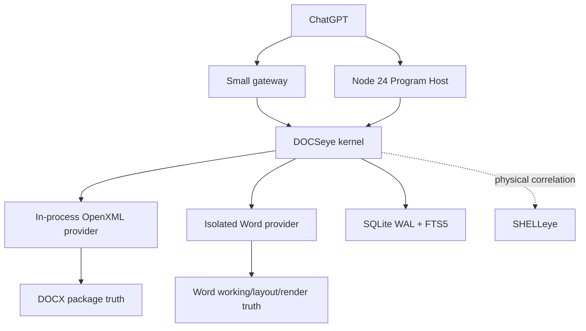

# 02 — Build 001: Persistent Document Correspondence Kernel Slice

Status: **PLANNED / NOT IMPLEMENTED**
Architecture: **FINAL / SYNTHESIZED / VERIFIED / FROZEN FOR BUILD 001**
Acceptance: **NOT RUN**

## 1. Thesis

Build 001 must prove that ChatGPT can retain exact semantic objects inside a rich DOCX across controller/provider death and hostile external edits; mutate only provable current targets through revision-aware multi-operation transactions; preserve unsupported native package truth; consume compact semantic/layout deltas; and execute a broad workflow locally with zero model calls between primitives.

This is the smallest decisive proof of the permanent DOCSeye spine. It is not a prototype, scaffolding exercise, DOCX-generation demo, text wrapper, Word automation demo, or partial milestone.

## 2. Frozen scope

### Editable format

Modern Word-generated **Transitional DOCX**.

### Derived format

Word-exported PDF is a layout/render artifact and derivative document. Build 001 does not implement a general PDF provider/editor.

### Word role

The isolated Word provider is mandatory for:

- real Word open/save/reopen compatibility;
- Word-owned unsaved-state coherence;
- native tracked/comment behavior required by the typed workflow;
- field update and pagination;
- semantic-to-page mapping;
- improved tagged fixed-format export.

Word is not the package preservation boundary, cold logical identity authority, or universal semantic provider.

## 3. Implementation baseline

```text
C# / .NET 10 kernel
  ├─ in-process OpenXML package provider
  │    ├─ Open XML SDK 3.5.1 typed interpretation/validation
  │    └─ raw OPC/XML preservation writer
  ├─ isolated/restartable Word native/layout adapter
  ├─ SQLite WAL + FTS5 operating state (corrected SQLite release)
  └─ local named-pipe/structured RPC

Node 24 Program Host
  └─ disposable, non-agentic, real typed DOCSeye SDK

SHELLeye integration where available
  └─ physical-file identity, coherent change signals, locks, atomic replacement
```

The package provider remains in-process unless an experiment establishes a real isolation need. Word is isolated because automation can hang, block, or outlive a caller. The Program Host owns no state.

## 4. Runtime topology



## 5. Deterministic rich fixture

The fixture is generated deterministically, then opened/saved once by current Word to establish a realistic native baseline. It is approximately 20–30 page-sensitive pages and contains:

- at least three sections with portrait/landscape, columns, page-number settings, and first/even/default header/footer inheritance;
- a heading hierarchy and ordinary paragraphs;
- three identical paragraph targets and three identical sentence occurrences;
- paragraph and character styles, direct formatting, `basedOn`, linked/theme effects, and a table style;
- nested lists, duplicate displayed ordinals, restart and override behavior;
- duplicate-valued table rows, grid spans, vertical merge, nested table, and repeating header;
- legacy and modern threaded comments with replies/resolution where current Word supports them;
- similar tracked insertions/deletions and property/table changes;
- real bookmarks;
- rich-text, checkbox, dropdown, date, and repeating-section content controls with IDs, tags, and custom-XML binding;
- TOC, PAGE, NUMPAGES, REF, PAGEREF, and date/updateable fields;
- footnote and endnote;
- internal and external links;
- one image asset used more than once, including one floating figure, crop, alt text, and caption;
- an OMML equation;
- custom XML;
- unknown ignorable namespace element and attribute in a touched XML part;
- complete `mc:AlternateContent` in that touched part;
- an opaque unhandled part and relationship;
- an embedded object;
- a DOCM preservation sibling containing VBA but never executing it;
- a signed constraint sibling used only for intrinsic signature-impact detection;
- content around page boundaries so one edit causes clear repagination.

Fixture-private stable keys may exist only for the external test oracle. Product target resolution may not read or use them.

## 6. Independent external adversary

The adversary is a deterministic raw-package mutator implemented independently of DOCSeye target resolution. It may preserve private oracle lineage but may not identify or resolve product targets.

It performs controlled paragraph move/clone/delete/recreate/split/merge, text offset shifts, run resegmentation, list insert/reorder/restart, row/column insertion/reorder/delete-recreate, comment-surrounding changes, provider-ID preservation/churn, partial-file-event sequences, and package/XML/ZIP reserialization.

A separate real Word adversary performs bounded open/save/reopen, tracked/field/layout behavior, and fixed-format export. Word is not invoked during the architecture-freeze pass.

## 7. Preservation baseline and oracles

Before every case record:

- package entry names and uncompressed SHA-256 payload hashes;
- content types;
- package/part relationship sets;
- XML namespaces and Markup Compatibility context;
- hashes/locations of unknown and opaque regions;
- signatures and covered parts/relationships;
- semantic snapshot in each required tracked-change/field projection;
- layout snapshot only where the case requires it.

Every case has two independent oracles:

1. fixture-private identity/operation oracle used only after the product acts;
2. package/semantic preservation oracle that checks the declared semantic-effect envelope and serialization footprint.

## 8. Exact implementation experiments — 30

Every item is **OPEN QUESTION — BUILD 001 EXPERIMENT REQUIRED**. No experiment was run during architecture freeze.

| ID | Question | Smallest experiment | Decision resolved / possible outcomes | Architecture impact |
| --- | --- | --- | --- | --- |
| E-01 | How stable is `w14:paraId`? | Word save, text/style edit, move, cut/paste, split, merge, copy and Save As on labeled paragraphs | Freeze operation-specific confidence table; stable, regenerated, or mixed | Changes provider evidence weights only |
| E-02 | What regenerates `w14:textId`? | Apply text, formatting, field-result and tracked-markup changes | Freeze paragraph-version witness rules | No change to external logical identity |
| E-03 | How does `w15:docId` branch? | Save, Save As, copy, template-derived and merge specimens | Confirm family/derivation use and contradictions | Never becomes branch identity |
| E-04 | Are row `paraId` witnesses stable? | Insert, delete, reorder, copy, merge, split and Save As table rows | Freeze row evidence confidence | Ambiguous rows still refuse |
| E-05 | Can proposed cell topology rules stay exact? | Duplicate rows, nested tables, grid insert, span, vMerge and split | Select minimal logical-grid representation and refusal boundary | Permanent cell semantics stay exact-or-stale |
| E-06 | How do content-control IDs behave? | Save/move/copy/nest/repeat/delete-recreate/Save As and duplicate-ID corruption | Freeze ID, tag, binding and repeating-section evidence | Native ID remains scoped witness |
| E-07 | How stable are modern comment durable IDs? | Surrounding edits, move anchor, reply, resolve, copy, Compare, Merge and delete/recreate | Freeze comment evidence order | Text never authorizes rebound |
| E-08 | How stable are native tracked-change IDs? | Similar changes, save/copy/Compare/Merge/accept/reject/external rewrite | Freeze exact change selection rules | Weak churn returns stale |
| E-09 | How do bookmarks survive edits? | Boundary insertion, range deletion, split/merge/move/copy and recreate same name | Freeze bookmark witness/refusal rules | No default injection |
| E-10 | How does section/header inheritance behave? | Edit linked source, section breaks, first/even flags and references | Freeze effective-source graph | Provider labels remain explicit |
| E-11 | What does SDK typed mutation preserve? | Local known edit beside unknown elements/attributes/prefixes | Measure raw and semantic footprint | SDK never assumed lossless |
| E-12 | What does MC handling preserve? | Edit `mc:AlternateContent` specimen with preprocessing disabled/enabled | Prove destructive boundary and required settings | MC preservation stays hard contract |
| E-13 | Which writer mechanism wins per operation? | Compare lexical splice and bounded typed subtree for ten edits | Choose per-operation strategy by validity, footprint and complexity | Contract is fixed; mechanism remains replaceable |
| E-14 | Can package copy-on-write preserve untouched payloads? | Replace one part while comparing entries, relationships and metadata | Freeze package writer and semantic ZIP-metadata policy | Untouched payload identity remains hard gate |
| E-15 | What does Word rewrite? | No-op open/save plus feature-specific saves; diff entries and semantics | Establish Word normalization profile | Word footprint judged separately |
| E-16 | Do custom XML, binding, OLE and opaque relationships survive? | One unrelated text edit then Word open/save/reparse | Select safe routes/refusals | Opaque preservation remains mandatory |
| E-17 | Can DOCM be edited without VBA loss? | Unrelated text edit with VBA part/relations hashed before/after | Freeze preservation-only DOCM envelope | Macro execution remains excluded |
| E-18 | Can signature impact be computed exactly? | Edit covered and uncovered targets in signed specimens | Freeze `signature_affected` detection | Validity preservation is not falsely promised |
| E-19 | What is the safe broker policy for an open Word document? | Characterize locks, sharing, unsaved edits, AutoSave and concurrent package access | Route via Word, save/reconcile, or conflict | Disk never overwrites live truth |
| E-20 | Which Word save events prove coherent lineage? | Correlate Word save callbacks, file events, temp files, replacement and package parseability | Freeze save-completion/stabilization predicate | Watcher events stay dirty signals |
| E-21 | Are atomic package replacement and crash boundaries correct? | Crash before/after temp flush, replace, DB commit and reopen | Freeze commit protocol/recovery order | No partial successful revision |
| E-22 | Can native tracked edits be authored safely? | Create exact insertion/deletion, open in Word, accept/reject and reparse | Select package versus Word route by operation | Native changes remain first class |
| E-23 | How should semantics map to Word pages/regions? | Compare COM ranges/WdInformation, Office.js Page, rectangles and exported tags | Select mapping provider/API and assurance | Page objects remain layout-scoped |
| E-24 | What proves field update and pagination completion? | Update TOC/PAGE/REF after reflow and observe APIs/results | Freeze `field/layout current` wait predicate | Cached result never masquerades as current |
| E-25 | How much DOCX-to-PDF correlation is exact? | Word improved-tagging export; map headings, tables, comments, equations, notes and pages | Freeze Build 001 render correlation ceiling | No general PDF identity claim |
| E-26 | Do accepted outputs open without repair? | Automate open/save/reopen/reparse for each writer family | Freeze compatibility gate/log detection | Compatibility is required, not separate architecture |
| E-27 | Does full indexing scale? | 100-, 500-, and 1,000-page DOCX; stream/DOM/FTS/lazy-media measurements | Select materialization/lazy thresholds | Full compact current index remains unless falsified |
| E-28 | Can external structural diff remain zero-false-promotion? | Paragraph/table/comment/style change corpus with private oracle | Select conservative correspondence algorithms | Similarity stays candidate-only |
| E-29 | Does Word Compare add useful evidence? | Compare its rich revisions to independent semantic diff | Define optional diff-provider scope | Never identity authority |
| E-30 | Do Program Host and SQLite recover correctly? | Run 60-call workflow; kill around index/package commits; exercise corrected WAL | Freeze batching, bounded history and DB recovery details | Host/state remain subordinate to provider truth |

Strict OOXML breadth, LibreOffice provider fidelity, PDF native identity/editing, OCR identity, and cloud coauthoring are post-Build-001 experiments and are intentionally excluded from this list.

## 9. Milestone A — Persistent Document Correspondence

### Retained set: exactly 24 concepts

```text
1 document
6 paragraphs/spans
1 list + 2 list items
1 table + 2 rows + 2 cells
2 comments
2 native tracked changes
2 content controls
1 bookmark
1 field
1 figure
```

### Acceptance sequence

1. Open the fixture, build the complete compact current index, and retain all 24.
2. Persist correspondence state; kill the kernel and package provider.
3. Restart against byte-identical package truth: all 24 recover `exact_current`.
4. Kill them again; run the combined independent observer-gap adversary.
5. Restart, build a new current index, and reconcile without oracle access.
6. The private oracle requires exactly:
   - **14 exact continuations**: document; three paragraphs/spans; list; one item; table; one row; one cell; one comment; one change; one control; field; figure;
   - **6 stale/destroyed**: two paragraphs/spans, one item, one row, one change, bookmark;
   - **4 ambiguous**: one paragraph/span, one cell, one comment, one control.
7. Read through all old handles. Attempt exact writes through every handle.
8. Only the 14 exact handles may write. All six stale/destroyed and four ambiguous handles refuse.
9. Exact-edit one recovered paragraph and the recovered table cell; verify postconditions and preservation.
10. Test controlled save, rename, controlled atomic replacement, and same-path unrelated replacement.

### Hard gate

- unchanged-byte exact recovery: 24/24;
- adversarial classification: 24/24 exactly as oracle;
- expected exact recoveries: 100%;
- expected stale/destroyed classifications: 100%;
- expected ambiguous classifications: 100%;
- false rebounds: 0;
- wrong-target edits: 0;
- provider/kernel death alone creates no semantic discontinuity;
- A fails if everything is merely marked stale.

## 10. Milestone B — Transactional Document World / Delta First

Milestone B proves the normal loop:

```text
query retained semantic world
→ begin expected-revision typed transaction
→ resolve exact targets in one snapshot
→ stage coherent mutations
→ validate semantic envelope + serialization footprint
→ commit atomically
→ consume compact semantic delta
→ obtain optional current Word layout
```

Required breadth includes paragraph/span, character/direct formatting, paragraph style, list, table row/cell, hyperlink, comment/thread, native tracked insertion/deletion, content control, bookmark, field, figure, note/equation inspection, and layout mapping.

### Required transaction proofs

- at least two coherent multi-operation transactions;
- one stale-base writer rejected;
- one exact deterministic rebase succeeds after unrelated change;
- one duplicate/ambiguous rebase refuses;
- one page-sensitive semantic edit invalidates layout and yields a current Word `LayoutRevision`;
- open-transaction rollback/crash leaves no partial persisted mutation;
- ordinary post-commit observation is delta-first, not a full-document resend;
- a local query over 10,000 paragraphs returns matches/summary only.

### Hard gate

- one transaction produces exactly one persisted `DocumentRevision`;
- requested postconditions: 100%;
- unrequested semantic mutation: 0;
- serialization-footprint escape: 0;
- unsupported-content loss: 0;
- unrelated part changes: 0;
- retained identities update correctly;
- current layout names its exact source document/provider revision.

## 11. Milestone C — 54-case hostile manifest

Each row is independently deterministic. `Effect/footprint` names the only allowed semantic change and serialization closure. `Oracle/cleanup` includes the write result, post-operation oracle, and reset.

| ID | Name; setup and retained objects | External/self mutation | Expected correspondence and write result | Allowed effect / serialization footprint | Oracle and cleanup |
| --- | --- | --- | --- | --- | --- |
| C-01 | Rename; retain document/representation/file binding | SHELLeye-confirmed rename | same document/representation; old path changes; write exact | binding metadata only; package untouched | IDs/path oracle; rename back |
| C-02 | Controlled atomic save; retain document and paragraph | DOCSeye commits via replacement | same document; new representation/file revision; paragraph exact | declared edit part/region plus carrier replacement | semantic/package hashes; restore baseline |
| C-03 | Word-observed save; retain document/Word binding | Word open/save rewrite | same document only through exact provider lineage | Word normalization profile; no unrequested semantics | event/package/semantic oracle; close Word/reset |
| C-04 | Same-path replacement; retain old document | unrelated valid DOCX replaces path | old binding detached/stale; no write to replacement | none | replacement untouched; restore original |
| C-05 | Copy/attachment; retain source | byte copy to new path | new document branch, `DERIVED_FROM` if observed; copied IDs do not collide | none | both branches distinct; delete copy |
| C-06 | Save As; retain source and active provider | Word/DOCSeye Save As | new document branch `DERIVED_FROM source@R`; source unchanged | new artifact only | source/new IDs and bytes; remove derivative |
| C-07 | PDF export; retain DOCX document/revision | Word fixed-format export | new PDF derivative `RENDER_OF/EXPORT_OF`; no semantic alias | new PDF artifact only | relation/source revision/page count; delete PDF |
| C-08 | Cold restart unchanged; retain all A objects | kill/restart kernel/provider | 24/24 exact; writes exact | no package mutation until requested | IDs/evidence oracle; restart cleanly |
| C-09 | Paragraph text edit; retain keyed paragraph | exact text replacement | same paragraph, new snapshot/textId as observed | one text region | text/identity/part diff; reset |
| C-10 | Style-only paragraph edit; retain paragraph | change style/direct formatting | same paragraph; formatting delta | pPr/rPr region only | formatting/text oracle; reset |
| C-11 | Keyed paragraph move | move paragraph in same story | exact only through operation/native lineage; otherwise stale | moved subtree/adjacent order only | original concept at exact destination; reset |
| C-12 | Duplicate insertion; retain original paragraph | insert identical paragraph nearby | retained original never follows text/ordinal | inserted subtree only | private lineage/wrong-target oracle; reset |
| C-13 | Delete/recreate identical paragraph | delete retained A, create identical C | A destroyed/stale; never C | deletion + new subtree | C has new concept; reset |
| C-14 | Paragraph split | split retained paragraph | old whole handle retired; explicit `SPLIT_FROM` children | original/replacement paragraph region | no child silently inherits write; reset |
| C-15 | Paragraph merge | merge two retained paragraphs | old handles retired; new `MERGED_FROM` concept | two paragraph regions | old writes refused; reset |
| C-16 | External-recovery killer; retain mixed A set | while absent: move keyed paragraph, clone it, delete/recreate another, reorder duplicate rows, alter comment context, churn weak IDs, reserialize | only strong/exact objects recover; prescribed stale/ambiguous outcomes; writes only exact | external rewrite; later product edit uses its own declared closure | 14/6/4 oracle; restore golden fixture |
| C-17 | Run resegmentation; retain paragraph/span | serializer splits/merges runs | semantic paragraph/span exact if boundaries unchanged; no run identity | run markup only | projection and span oracle; reset |
| C-18 | Known offset shift | insert 400 chars before retained span through DOCSeye | deterministic `exact_rebased` | insertion region only | exact selected text changed, not offset peer; reset |
| C-19 | Native anchored shift | external insert around bookmark/control-anchored span | exact only if both native boundaries survive uniquely | external change; product edit exact target region | anchor and target oracle; reset |
| C-20 | Wrong-span killer; middle of three identical sentences retained | shift offsets and insert another identical sentence | exact original or ambiguous; never another occurrence | none on refusal or exact selected region | wrong occurrence mutation = 0; reset |
| C-21 | List insert above; retain item/paragraph | insert earlier list item | same item, new ordinal/display label | new paragraph + numbering refs | item identity/display delta; reset |
| C-22 | Duplicate list reorder | reorder duplicate-valued items | operation-lineage exact or ambiguous; no value rebound | order only | private item lineage; reset |
| C-23 | Numbering restart/definition | change restart/override and format | item identities remain; intentional label fan-out | numbering part/numPr only | paragraph text unchanged; reset |
| C-24 | Duplicate displayed ordinal | two list instances both show same ordinal | queries return both; retained item stays in list parent | none or exact item edit | parent/list identity oracle; reset |
| C-25 | Item to plain paragraph | remove numbering from retained item | paragraph may remain; list-item relation retires | paragraph numPr only | lifecycle oracle; reset |
| C-26 | Row insertion above cell | retain row/cell; insert row | retained objects do not follow old coordinate | new row/table region | exact row/cell oracle; reset |
| C-27 | Primary identity killer; duplicate-valued rows/cells retained | insert, reorder, clone and delete/recreate duplicate rows | exact original cell or stale/ambiguous; never another row | none on refusal or exact cell region | wrong-cell write = 0; restore table |
| C-28 | Delete/recreate row | delete retained row; insert identical row | old row/cells destroyed | delete/new row regions | new concepts; reset |
| C-29 | Known column/grid insertion | DOCSeye inserts column before retained cell | deterministic exact topology transform | table grid and affected cells only | retained logical cell exact; reset |
| C-30 | External grid insertion ambiguity | foreign column insert with insufficient cell evidence | old cell stale/ambiguous; no coordinate rebound | none on refusal | table unchanged by attempted write; reset |
| C-31 | Cell merge | merge retained cells | old cells retire; new `cell_region_* MERGED_FROM` | selected table region | old writes refused; reset |
| C-32 | Cell split | split retained merged cell | old region retires; explicit descendants | selected table region | no implicit upper-left continuation; reset |
| C-33 | Nested-table collision | identical value in outer and nested cells | parent table topology prevents cross-target | exact chosen cell only | non-target cell hash unchanged; reset |
| C-34 | Table style-only change | retain table/rows/cells | change table style | structure concepts remain; formatting delta | table properties/styles only | topology unchanged; reset |
| C-35 | Durable comment anchor + duplicate quote | retain modern comment; alter surroundings and add same quote elsewhere | same comment only through durable/native anchor; never quote search | surrounding paragraph edit only | comment/thread/anchor oracle; reset |
| C-36 | Comment reply/thread | retain parent; add reply | parent retained; new reply relation | comment extension parts only | thread oracle; reset |
| C-37 | Comment delete/recreate | delete retained comment; create visually identical | old comment destroyed/stale | comment/range parts | new concept; reset |
| C-38 | Weak comment-ID churn | churn legacy/weak IDs with similar text/time | exact only with sufficient full anchor evidence; otherwise stale | none on refusal | no candidate stealing; reset |
| C-39 | Similar tracked insertions | retain one of two similar changes | exact provider/lineage handle or ambiguous | none or exact selected change | non-target revision unchanged; reset |
| C-40 | Exact accept/reject | retain exact change | accept one and reject another in separate runs | only chosen native change semantics | exact markup/result oracle; reset |
| C-41 | External acceptance + ID churn | accept retained change externally and churn remaining IDs | accepted change retires; old handle never selects similar remainder | none on old-handle attempt | wrong acceptance = 0; reset |
| C-42 | Control continuity + duplicate Tag | retain two same-Tag controls with distinct IDs | normal save/move | both exact by scoped native evidence; Tag query returns both | exact chosen control only | IDs/bindings oracle; reset |
| C-43 | Duplicate control ID conflict | adversary creates duplicate native ID | conflict/ambiguous; no handle stealing | none | both controls unchanged; repair/reset fixture |
| C-44 | Repeating-section rebuild | retain parent and repeated child controls | add/reorder/delete repeated item | exact only where provider/operation lineage proves; others stale | repeating-section region only | lineage oracle; reset |
| C-45 | Bookmark lifecycle pair | retain bookmark M and bookmark N | move M boundaries; delete/recreate N same name | M exact if marker pair survives; old N destroyed | marker regions only | M/N distinct outcomes; reset |
| C-46 | Field instruction/result separation | retain field | change result only, then instruction | same field when native structure exact; separate deltas | field result or instruction region as declared | projection oracle; reset |
| C-47 | Style fan-out | retain style and dependent paragraphs | modify style definition | same style; intentional effective-formatting fan-out | styles part only | text/paragraph IDs unchanged; reset |
| C-48 | Header/footer inheritance | retain section/effective source | change linked source and section flags | correct effective-source relation; no fake duplicated objects | source header/footer + section refs only | visible/effective graph oracle; reset |
| C-49 | Preservation killer | touched main part contains unknown element/attribute + AlternateContent; package contains custom XML binding, opaque part/relation, media/embedding, notes/header/footer | ordinary known paragraph edit; Word open/save/reparse after pre-Word checks | semantic target exact; all unsupported truth survives | exact text region; untouched payloads/relations identical | hashes, semantic diff, Word no-repair; restore golden |
| C-50 | Macro + signature constraints | DOCM VBA specimen and signed DOCX specimen | unrelated supported text edit | VBA payload/relations byte-identical; exact signature coverage effect reported; validity not falsely promised | declared text region; no VBA rewrite | macro hash + signature oracle; reset |
| C-51 | Concurrent external save | begin transaction, then external save | commit phase re-witnesses changed base | abort conflict or deterministic exact rebase; never overwrite | none on abort or fresh exact closure | external revision preserved; reset |
| C-52 | Partial save events | emit temp/incomplete/multiple file states | watcher/recovery observes sequence | no incomplete state becomes DocumentRevision | none | committed revision/delta count unchanged; cleanup temp files |
| C-53 | Crash atomicity | crash before and around physical commit points | restart recovery | no reported success without complete validated representation; no half revision | candidate/temp only before commit | DB/package consistency oracle; cleanup temps |
| C-54 | Layout invalidation | retain paragraphs, floating figure and page views | insert page-sensitive paragraph | semantic objects remain; new LayoutRevision; old pages/regions expire | paragraph region; derived layout/render may change | semantic IDs/page mapping/affected pages; reset |

### Primary killers

- **Identity:** C-27, duplicate-row/cell insert/reorder/delete-recreate.
- **Wrong span:** C-20, middle of repeated identical sentence after offset churn.
- **Preservation:** C-49, known edit beside unknown/AlternateContent with opaque package truth.
- **External recovery:** C-16, combined observer-gap rewrite with mixed evidence strengths.

## 12. Milestone C hard metrics

Required zeros:

```text
false semantic-object rebounds                     = 0
wrong-target accepted edits                        = 0
stale-base edits silently applied                  = 0
ambiguous targets silently selected                = 0
concurrent external revisions silently overwritten = 0
unrequested semantic mutations                     = 0
unsupported fixture-content losses                 = 0
serialization-footprint escapes                    = 0
invalid package commits                            = 0
partial successful commits                         = 0
silent document/representation revision gaps       = 0
silent delta gaps                                  = 0
undetected signature-impact cases                  = 0
```

Required positives:

```text
oracle-defined exact recoveries                     = 100%
oracle-defined stale/destroyed classifications      = 100%
oracle-defined ambiguity classifications            = 100%
requested semantic postconditions                  = 100%
mutation-contract violations rejected              = 100%
untouched opaque fixture payload retention          = 100%
declared relationship/content-type changes only    = 100%
accepted Word outputs opening without repair        = 100%
```

All 54 cases must run through direct typed operations. The relevant mutation/recovery subset also runs through the real Program Host SDK; wrapper parity is required, but this does not double the case count.

## 13. Milestone D — exactly 60 typed operations

One Node 24 Program Host invocation executes the following meaningful DOCSeye calls. Query-and-retain path calls are explicit SDK operations that atomically select and promote the returned object path; they are not hidden raw scripts. The independent external adversary between calls 50 and 51 is not counted.

| # | Typed operation | Purpose |
| ---: | --- | --- |
| 1 | `document.sync` | establish coherent current provider state |
| 2 | `document.get_coherence` | record document/representation/provider vector |
| 3 | `section.query_heading_tree` | inspect semantic hierarchy |
| 4 | `section.retain` | retain exact target section |
| 5 | `text.query_occurrences` | find duplicate phrase under section |
| 6 | `paragraph.retain` | retain exact paragraph occurrence |
| 7 | `text.retain_span` | retain exact middle span |
| 8 | `style.inspect_chain` | declared/inherited/effective formatting |
| 9 | `comment.query_and_retain` | retain exact unresolved comment |
| 10 | `change.query_and_retain` | retain exact native change |
| 11 | `table.query_and_retain_path` | retain table, duplicate-valued row, and cell |
| 12 | `list.query_and_retain_item` | retain nested list item |
| 13 | `control.query_and_retain` | retain tagged/bound content control |
| 14 | `field.inspect` | instruction/result/staleness |
| 15 | `note.inspect_related` | footnote/endnote semantic slice |
| 16 | `link.inspect_related` | internal/external link state |
| 17 | `figure.inspect` | occurrence versus media asset |
| 18 | `math.inspect` | OMML without flattening |
| 19 | `transaction.begin` | pin expected revisions and mutation contract |
| 20 | `text.replace_span` | mutation 1 |
| 21 | `paragraph.insert_after` | mutation 2 |
| 22 | `text.apply_character_format` | mutation 3 |
| 23 | `paragraph.set_style` | mutation 4 |
| 24 | `list.insert_item` | mutation 5 |
| 25 | `list.set_item_text` | mutation 6 |
| 26 | `list.change_level` | mutation 7 |
| 27 | `list.move_item` | mutation 8 |
| 28 | `list.restart_numbering` | mutation 9 |
| 29 | `table.insert_row` | mutation 10 |
| 30 | `table.set_cell` | mutation 11, inserted row cell 1 |
| 31 | `table.set_cell` | mutation 12, inserted row cell 2 |
| 32 | `table.set_cell` | mutation 13, inserted row cell 3 |
| 33 | `table.set_cell` | mutation 14, inserted row cell 4 |
| 34 | `table.move_row` | mutation 15 |
| 35 | `table.set_cell` | mutation 16, old retained cell after reorder |
| 36 | `link.add` | mutation 17 |
| 37 | `comment.add` | mutation 18 |
| 38 | `comment.reply` | mutation 19 |
| 39 | `control.set_value` | mutation 20 |
| 40 | `change.insert_tracked` | mutation 21 |
| 41 | `change.delete_tracked` | mutation 22 |
| 42 | `bookmark.upsert` | mutation 23 |
| 43 | `figure.set_alt_text` | mutation 24 |
| 44 | `list.set_definition` | mutation 25, intentional fan-out |
| 45 | `transaction.validate` | semantic/serialization/package precommit check |
| 46 | `transaction.commit` | atomic commit 1 |
| 47 | `delta.read` | consume bounded semantic delta |
| 48 | `layout.wait_current` | await Word layout based on committed revision |
| 49 | `layout.affected_regions` | map changed semantics to pages/regions |
| 50 | `render.pages` | render only affected pages |
| — | independent adversary | external row/comment/ID rewrite; not a DOCSeye call |
| 51 | `document.sync` | ingest coherent external revision |
| 52 | `correspondence.inspect` | receive exact/stale/ambiguous outcomes; branch locally |
| 53 | `transaction.begin` | begin exact second transaction; ambiguous handle excluded |
| 54 | `table.set_cell` | mutation 26 through exact rebound cell |
| 55 | `change.accept` | mutation 27 through exact retained change |
| 56 | `comment.resolve` | mutation 28 through exact retained comment |
| 57 | `field.request_update` | mutation 29 through Word provider |
| 58 | `transaction.validate_preservation` | recheck mutation closure/signature state |
| 59 | `transaction.commit` | atomic commit 2 |
| 60 | `delta.read_and_summarize` | consume final delta and return compact payload |

### D hard gate

- exactly 60 meaningful typed operations;
- 29 genuine mutations;
- 15 semantic object families;
- two atomic commits;
- one external reconciliation and local exact/ambiguous branch;
- two semantic-delta consumptions;
- one current-layout wait and affected-page render;
- zero model calls between primitives;
- no direct ZIP, raw OpenXML script, python-docx, Word VBA, or fixture-private API bypass;
- compact structured result containing revisions, retained-object outcomes, delta summaries, preservation results, and affected pages—not raw XML/tree/transcripts.

The count is derived from the workflow's required semantic breadth and mutation density. It is not inherited from a sibling substrate.

## 14. Benchmark

Compare:

1. flat-text/model extraction → regeneration;
2. conventional library/position-based script without persistent correspondence;
3. DOCSeye retained world → typed transaction → delta/Program Host.

Tasks:

1. inspect a rich 30-page document;
2. target the middle duplicate paragraph/span after offset churn;
3. edit a table cell after duplicate-row reorder;
4. comment/tracked-change exact workflow;
5. restart/external-edit recovery;
6. the 60-operation Program Host workflow.

Measure cold and warm:

- model-facing input/output bytes and tokens;
- full-document rediscoveries and model turns;
- operations per model turn;
- provider/RPC calls;
- parse/index/query/transaction/commit/recovery/layout latency;
- memory and SQLite/index size;
- semantic delta size;
- changed package parts and XML regions;
- pages rendered;
- wrong-target/stale/ambiguity counts;
- preservation and Word-repair failures.

Correctness metrics are hard gates. Performance is measured evidence; no aggressive latency threshold is frozen before implementation.

## 15. Real-world smoke target

After deterministic A–D gates, select one publicly redistributable current Word-generated specification/report with substantial sections, tables, figures, links, and formatting. Prefer an official Microsoft Open Specifications DOCX if the exact artifact and redistribution terms are reproducible.

The smoke is post-gate generalization, not a substitute for deterministic identity/preservation oracles and not a reason to download/modify an artifact during architecture freeze.

## 16. Build 001 non-goals

- complete PDF provider or arbitrary PDF content-stream editing;
- ODF editing;
- HTML/EPUB provider breadth;
- PPTX or XLSX deep semantics;
- live multi-user coauthoring/OT engine;
- all Word features or full Word GUI automation;
- broad cloud integration;
- complete Strict OOXML mutation guarantee;
- general OCR/CV;
- macro execution;
- digital-signature creation or preservation of validity when signed coverage changes;
- universal conversion or document merge product;
- custom Word-compatible layout engine;
- complete field evaluation engine independent of Word;
- graph database, document-management history, or permanent action ledger;
- accessibility-compliance product;
- Word/LibreOffice pagination equivalence;
- performance gates without measurement.

## 17. Cleanup and reproducibility

Each hostile case starts from a cryptographically identified golden fixture copy and ends by closing Word/provider handles, deleting derivative/temp outputs, resetting the fixture, and confirming no persistent concept/database contamination outside that case namespace.

Temporary packages are written only beneath an explicit Build 001 test root. The canonical fixture source and independent adversary manifest are immutable during a run. Real-world smoke outputs are disposable.

## 18. Completion definition

Build 001 is complete only when:

1. all 30 experiments have recorded results and promoted any mechanism corrections without violating frozen semantics;
2. Milestone A passes exact 24-object unchanged and 14/6/4 observer-gap recovery;
3. Milestone B passes transaction/delta/layout/concurrency gates;
4. all 54 Milestone C cases pass every zero and positive metric;
5. the exact 60-operation Milestone D program passes;
6. current Word opens every accepted compatibility specimen without repair;
7. benchmark measurements and real-world smoke are recorded;
8. cleanup succeeds;
9. `docs/09-BUILD-001-RESULTS.md` records measured machine/toolchain versions, case outcomes, deviations, and exact Git baseline;
10. GitHub issues #1–#4 are closed only after their individual gates, then parent #5 closes.

Until all ten conditions hold:

```text
DOCSeye Build 001:      PLANNED / NOT IMPLEMENTED or IN PROGRESS
Product implementation: NOT STARTED or IN PROGRESS
Build 001 acceptance:   NOT RUN or NOT PASSED
```
