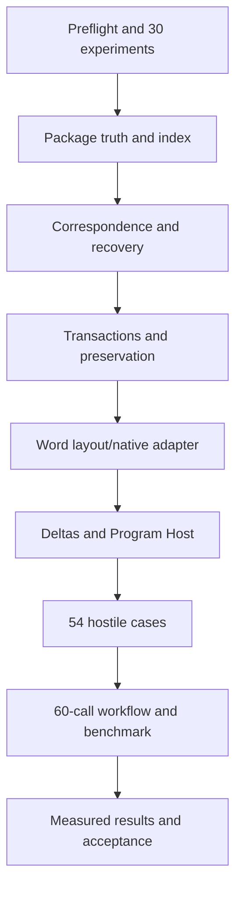

# 04 — Roadmap

Status: **Build 001 planned; no implementation started**

## 1. Sequencing rule

DOCSeye advances by decisive vertical slices, not by accumulating format wrappers. A build is complete only when its hostile correctness gates pass. A provider, object type, or operation that cannot satisfy exact targeting and preservation is reported as unsupported rather than quietly approximated.

The only authorized implementation scope at this freeze is Build 001.

## 2. Pre-implementation gate

Before implementation begins:

1. read the canonical documents in `AUTHORITY.md` order;
2. record the exact architecture-freeze commit;
3. complete the STEALTHEYELLC preflight in issue #1;
4. pin corrected toolchain dependencies;
5. create the deterministic fixture specification and oracle without implementing product shortcuts;
6. confirm issues #1–#5 still match the canonical documents;
7. preserve the documentation-only baseline in Git.

## 3. Build 001 — Persistent Document Correspondence Kernel Slice

### Objective

Prove the complete permanent spine against editable Transitional DOCX and a mandatory bounded Word provider.

### Workstreams

| Workstream | Scope | Exit gate |
| --- | --- | --- |
| #1 Environment and experiments | platform preflight and all 30 bounded experiments | every experiment records evidence and a mechanism conclusion |
| #2 Milestone A | package ingestion, full index, retained concepts, persistence, recovery | exact 24/24 unchanged restart and 14 exact / 6 stale-destroyed / 4 ambiguous external recovery |
| #3 Milestone B | typed transactions, preservation contract, deltas, concurrency, Word layout | atomic commits, exact/ambiguous rebase behavior, no footprint escape, current layout |
| #4 Milestone C and D | all 54 hostile cases and exact 60-call Program Host workflow | every zero/positive metric passes |
| #5 Parent acceptance | cross-workstream integration, benchmark, smoke, cleanup, results | `docs/09-BUILD-001-RESULTS.md`, all child gates closed |

### Build order

The recommended order is:

This ordering does not authorize implementing only the easy package path and deferring Word or preservation. Both are required parts of the Build 001 exit gate.

### Completion state

At freeze time:

| Item | State |
| --- | --- |
| Architecture | FINAL / SYNTHESIZED / VERIFIED / FROZEN FOR BUILD 001 |
| Source code | NOT STARTED |
| Fixtures/adversary | NOT STARTED |
| Experiments | NOT RUN |
| Milestones A–D | PLANNED / NOT IMPLEMENTED |
| Benchmark | NOT RUN |
| Acceptance | NOT RUN |

## 4. Build 002 candidate — Provider hardening and PDF observation

This is a candidate direction, not authorized scope. It may begin only after Build 001 passes and a new freeze records its exact thesis.

Candidate questions:

- harden Strict OOXML and `.docm` preservation beyond experiments;
- broaden native comments, revisions, fields, sections, shapes, and charts;
- add PDF as a first-class fixed-layout/tagged provider for inspection, annotations, forms, pages, outlines, and exact native redaction where supported;
- test DOCX-to-PDF source/structure/page correspondence;
- add a LibreOffice fidelity/layout adversary or provider;
- validate much larger documents and bounded-history policies.

Build 002 must not reinterpret heuristic PDF paragraphs as exact DOCX-like mutation objects.

## 5. Later provider candidates

Subject to separate research and freeze passes:

| Candidate | Intended boundary |
| --- | --- |
| ODF | native ODF package, content, style, change, and layout facets |
| Static HTML | persistent serialized HTML/document semantics; live state remains eyeBROWSE |
| Markdown | document/publishing facet correlated with CODEeye source truth |
| Cloud Word/Google Docs | provider-native item/revision/named-range/coauthoring semantics |
| OCR/inference | explicitly derived observations over fixed-layout/scanned material |

PPTX and XLSX do not become DOCSeye providers merely because they use OPC. Deep presentation semantics belong to a presentation substrate; workbook/formula semantics belong to DATAeye.

## 6. Permanent non-roadmap

The following are not hidden future obligations of DOCSeye:

- one universal document AST;
- fuzzy mutation targeting;
- mandatory hidden ID injection;
- Word as the sole canonical store;
- a document graph database or permanent action ledger;
- general file conversion;
- arbitrary rich PDF content-stream editing;
- custom Word-compatible pagination;
- macro/OLE execution;
- Office UI automation inside the kernel;
- XLSX/PPTX ownership.

Any later proposal that introduces one of these must reopen the architecture explicitly and demonstrate why the frozen invariants still hold.

## 7. Change control

Build 001 experiments may change mechanisms—such as lexical patch granularity, exact Word API choice, or streaming thresholds—without reopening the architecture. They may not silently change:

- logical versus provider-native identity;
- exact-or-stale mutation;
- provider authority;
- the separate revision model;
- full current indexing plus sparse durable promotion;
- two-dimensional mutation contracts;
- preservation outside mutation closure;
- 54 hostile cases, 60 typed calls, or zero metrics.

A semantic change requires an explicit decision update, canonical-document patch, and review before implementation relies on it.
