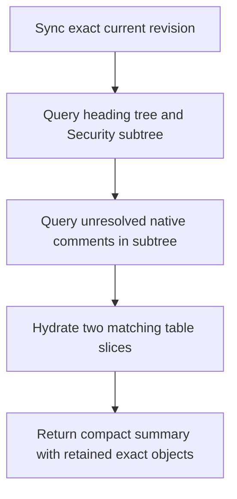

# 08 — Workflow Pressure Tests

Status: **DESIGN PRESSURE TESTS / NOT EXECUTED**

## 1. Purpose

These workflows test whether the frozen architecture remains coherent when used as ChatGPT would actually use it. They are architectural walkthroughs, not Build 001 evidence. Measured acceptance comes only from `02-BUILD-001-SLICE.md` and the future results document.

Each workflow must preserve two invariants:

1. the old handle either reaches the provable current object or refuses to mutate;
2. accepted work changes only its declared semantic effect and serialization footprint.

## 2. Inspect a large policy document without retransmitting it

**Request:** “Find every unresolved comment under the Security heading, summarize the concerns, and show the two relevant tables.”

Pressure points:

- full current index makes the search local;
- comment anchors and tables remain semantic objects rather than flattened text;
- the model receives only bounded semantic slices;
- no persistent ID is assigned to every query hit unless retained;
- no document mutation or layout rendering is needed.

Failure that would falsify the architecture: the kernel must resend or reparse the whole document for every turn, or the response cannot distinguish comment text from anchor text.

## 3. Edit the middle of identical sentences after external offset drift

**Request sequence:** retain the middle of three identical sentences; an external editor inserts text above and introduces a fourth identical sentence; later replace the retained span.

Required behavior:

1. recover the exact parent paragraph;
2. apply known transforms and surviving native boundary evidence;
3. prove a unique start/end mapping and precondition;
4. mutate only if the result is `exact_rebased`;
5. otherwise return `ambiguous_target` with candidates for a new explicit selection.

Text search, nearest occurrence, embeddings, page location, and old offsets cannot authorize the old write.

This is Build 001 case C-20 and the primary wrong-span killer.

## 4. Update a retained table cell after duplicate-row edits

**Request sequence:** retain a cell in one of two visually identical rows; insert a row above; move the retained row; duplicate its values; delete/recreate another identical row; then update the old cell.

The kernel must evaluate:

- exact table concept;
- row operation/native lineage;
- physical cell realization;
- logical grid interval and merge topology;
- descendant anchors and structural neighbors;
- the intervening revision sequence.

If the original row/cell is provable, its coordinate may change while identity persists. If evidence is insufficient, the handle is stale/ambiguous. It can never follow the old coordinate or matching values.

This is C-27 and the primary general identity killer.

## 5. Bulk editorial pass with comments and native tracking

**Request:** “In one operation, revise this section, add two comments, track the substantive insertions/deletions, update a content control, and add a table row.”

Required flow:

1. begin one expected-revision transaction;
2. resolve every target inside the same coherent representation;
3. route plain/package-safe operations to the package provider and native-only/live operations through Word without losing transaction semantics;
4. validate semantic effect and serialization footprint;
5. recheck provider/physical revisions;
6. commit one logical DocumentRevision or nothing;
7. emit a compact delta that distinguishes DOCSeye revision from native tracked changes;
8. invalidate layout.

Failure: six loosely sequenced saves, a native tracked change confused with document history, or partial success after a conflict.

## 6. Word is open with unsaved edits

**Request:** edit a paragraph while the corresponding Word document has newer unsaved user changes.

Required behavior:

- provider coherence reports Word ahead of package;
- package mutation cannot proceed against the stale disk state;
- the broker routes through the exact live Word provider epoch, requests a coherent save/snapshot, or returns `provider_ahead`/conflict;
- a stale COM/Office.js handle from an older epoch is rejected;
- a successful result identifies the new DocumentRevision, Word ProviderRevision, and persisted PackageRevision relationship.

Failure: silently overwriting the live changes with a patched disk package.

## 7. External Word save while a transaction is staged

**Request sequence:** begin at D42/P42, stage several edits, then Word or another process saves D43 before commit.

Required behavior:

1. precommit revalidation sees the provider/physical mismatch;
2. if every operation and precondition transforms exactly onto D43, construct and validate a fresh transaction;
3. otherwise abort with a typed conflict;
4. never replace the new carrier blindly;
5. publish no D44 if physical commit did not succeed.

This is C-51. The transaction cannot rely only on the revision checked at begin time.

## 8. Save As, copy, rename, and PDF export

| Event | Required correspondence result |
| --- | --- |
| Rename/move with exact physical continuity | same `document_*`, new location binding |
| DOCSeye atomic save | same document, new representation/document revision |
| Word save with exact live lineage | same document, new revision |
| Save As | new document with `DERIVED_FROM source@revision` |
| Raw copy/email attachment | new branch candidate; copied IDs do not prove sameness |
| Unrelated file at old path | old binding detached; no path rebound |
| DOCX-to-PDF export | new derivative fixed-layout document or retained render revision |

This workflow pressure-tests logical branch identity against physical-carrier convenience.

## 9. Update a TOC and page-dependent fields

**Request:** change a heading, update the TOC/PAGE/PAGEREF fields, and report affected pages.

Required behavior:

- heading/style mutation creates a new semantic DocumentRevision;
- stored field instruction and cached result remain separately observable;
- Word performs qualified recalculation and repagination;
- the kernel waits until the Word layout is based on the new semantic/provider revision;
- a new LayoutRevision and field-result state are published;
- old `page_view_*` objects become stale;
- unchanged paragraph concepts survive even where page numbers shift.

Failure: treating an update-on-open flag as a completed field result or reusing old page handles.

## 10. Edit beside unsupported OOXML

**Request:** replace ordinary paragraph text in a part that also contains unknown ignorable markup and complete `mc:AlternateContent`; the package contains custom XML, an opaque part, OLE/media, and unknown relationships.

The accepted operation must prove:

- the requested semantic postcondition;
- no unrequested semantic diff;
- exact untouched-entry payload equality;
- no relationship/content-type escape;
- intact AlternateContent and unknown attributes/elements;
- intact custom XML/opaque/embedding/media payloads;
- valid package and Word open-without-repair.

If the exact edit boundary intersects unsupported structure that cannot be preserved, the correct result is `unsafe_preservation_boundary`, not a simplified save.

This is C-49 and the primary preservation killer.

## 11. Kernel crash around package commit

The crash harness terminates the kernel at each boundary:

1. before candidate package creation;
2. during candidate write;
3. after candidate validation but before physical replacement;
4. during the replacement protocol;
5. after physical replacement but before SQLite publication;
6. after SQLite publication but before response delivery.

Required invariant: every restart reconciles to either the complete old or complete new provider artifact. No half package is acknowledged; no acknowledged commit lacks a complete artifact. If the package advanced but response/publication was interrupted, restart discovers and reconciles the committed truth without replaying the mutation blindly.

## 12. Comment deletion and recreation

**Request sequence:** retain comment “Approved” on one range; an external editor deletes it and creates identical text/author near another identical quote; later resolve the old comment.

Required behavior:

- the old comment becomes destroyed/stale unless its exact native object survives;
- durable/legacy IDs and native anchor/thread structure outrank text;
- quoted text and author/time can retrieve candidates only;
- resolving the old handle never resolves the replacement.

The same rule applies to visually similar native tracked changes.

## 13. Content-control form workflow

**Request:** find controls tagged `Approval`, inspect bindings, and set the one inside the target section.

Required behavior:

- a tag query may return several controls;
- selection is made using exact control IDs, document lineage, parent concept, type, and binding;
- setting a retained control validates current native identity and expected value/type;
- duplicate/malformed IDs or repeating-section reconstruction produce conflict/stale/ambiguous as appropriate;
- custom XML binding is preserved and updated only inside the declared effect.

Failure: treating Tag as unique or silently selecting the first control.

## 14. Fifty-plus local operations in one model turn

The exact Milestone D program performs 60 typed calls with 29 mutations. The architecture must keep:

- identity decisions in the kernel, not arbitrary JavaScript;
- raw package access outside the acceptance path;
- transaction boundaries explicit;
- local branches based on typed resolution states;
- only compact deltas, metrics, and selected semantic slices in the final model payload;
- zero model calls between primitives.

Failure: a single giant raw OpenXML function masquerading as one typed call, or one model round trip per cell/comment/list item.

## 15. Tagged and untagged PDF later

**Tagged PDF request:** inspect headings, figures, and reading order. DOCSeye exposes stored structure-tree truth with provider-scoped keys and notes that native tagging can still be semantically poor.

**Untagged/scanned PDF request:** locate paragraph-like content. DOCSeye returns fixed-layout glyph/region truth plus `heuristic_structure` or `ocr_derived` observations. It does not claim a native paragraph or permit an inferred block to authorize destructive content mutation.

Page objects can have retained identity inside a proven PDF representation lineage; page ordinal remains location. This workflow validates that the common substrate does not force DOCX semantics onto PDF.

## 16. Cross-substrate publication workflow

**Request:** update a Markdown source in a repository, render it to static HTML/PDF, and correlate it to a DOCX publication artifact.

- CODEeye owns the Markdown source and engineering edit.
- eyeBROWSE owns a live web page if one is involved.
- DOCSeye owns persistent document representations and semantic/layout/render correspondence.
- SHELLeye owns physical files and replacements.
- derivation links connect exact source/document revisions without collapsing identities.

Failure: one universal graph silently makes the rendered document, source file, browser page, and exported PDF the same object.

## 17. Pressure-test verdict

The architecture remains coherent across all workflows because it refuses four seductive shortcuts:

1. path/text/position as identity;
2. one provider as universal truth;
3. semantic postcondition as sufficient preservation evidence;
4. local scripting as permission to bypass typed correspondence.

The workflows expose implementation risk—especially surgical OOXML preservation, Word coherence, table-cell recovery, and exact layout mapping—but no unresolved workflow requires changing the frozen semantic spine. Those risks are isolated in the 30 Build 001 experiments and 54 deterministic hostile cases.
